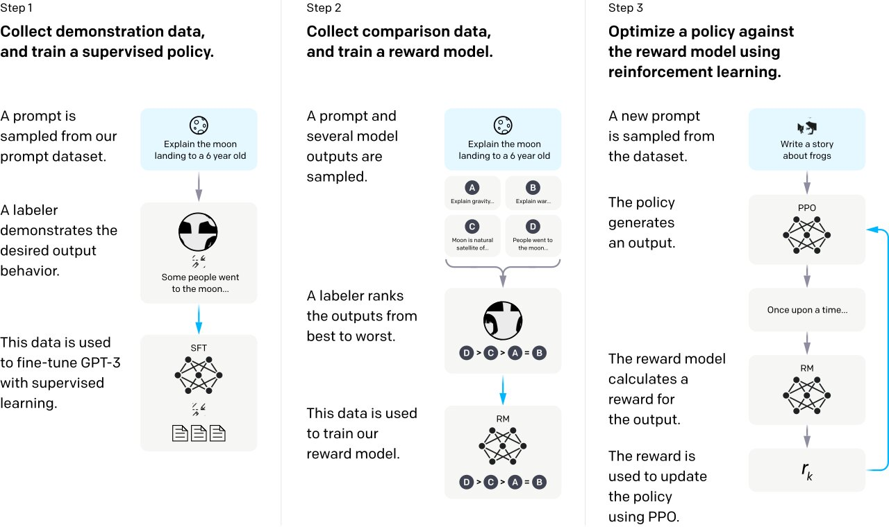

## Introduction

The idea of OpenAssistant is to be a chat-based assistant that can perform a wide range of tasks, interact with external systems, and retrieve information dynamically. It is designed as a free, open-source software that is easy to extend and personalize. It’s goal is to give everyone access to LLMs that can revolutionize the way we use language and improve the world. Similar to how StabilityAI/CompVis open-sourced the technology behing prompt based diffusion models using StableDiffusion, taking it away from DALL-E; OpenAssistant intends to do the same with ChatGPT.

However, OpenAssistant aims to go beyond just replicating ChatGPT. The original team wants to build the assistant of the future, capable of performing meaningful work, using APIs, conducting dynamic research, and much more. OpenAssistant should be personalized and extendable by anyone and be small and efficient enough to run on consumer hardware. The project is open and accessible, and the team wants to build not only a great assistant but also make it available to the masses.

## The Project

Though OA is still not out yet (heads up! You can visit their project to keep up to date with the latest news: [https://github.com/LAION-AI/Open-Assistant](https://github.com/LAION-AI/Open-Assistant)), thier current aim is to quickly launch an MVP following the InstructGPT paper. The process involves:

1. Collection of high-quality human-generated Instruction-Fulfillment samples (prompts and responses). The project will use a crowdsourced process to collect and review the prompts, and a leaderboard will be created to motivate the community and show progress.
2. Sampling of multiple completions for each prompt. The completions will be shown randomly to users, who will rank them from best to worst. The ranking data will be used to train a reward model.
3. RLHF training phase based on the prompts and reward model.

### Supervised fine tuning on human demonstration data:

As seen from the above diagram, first, data needs to be collected showing demonstrations of assistant interactions. InstructGPT for example has 13,000 of these demonstrations, and the OA team estimates that about 50,000 demonstrations would suffice for the MVP. A demonstration can be described as a conversation thread between OA and a human prompter. Using the OA website, prompters are given a random task, either to act as the user or act as the assistant. This means that via a crowdsource effort, conversation threads on various topics can be collected. Moreover, it is also possible to use pseudo-data, for example from a QA dataset before the real data is collected. This is because human generated data will always beat pseudo data, obviously until we reach AGI or LLMs are capable of producting human level creativity. Additionally, it is also possible to create prompt data from websites like Quora, StackOverFlow, and Reddit, though there needs to be some form of safety to avoid biases. 

Using this collected data, a base model is then fine tuned using supervised learning. Some of the common candidates include GPT-J, FlanT5, GPT-JT, and some others.  

### Training a reward model and RLHF:

Using the OA website, another task that prompters are able to do, is rank responses based on a number of criteria, including, it’s quality, helpfulness, creativity, humour, politness, and finally the level of harm in the response. This data can then be used to train a reward model, for example using human-in-the-loop active learning techniques, which would drastically reduce the amount of needed data. An RLHF can then be run on this reward model following InstructGPT. 

 

## Final Thoughts

As the use of AI becomes more prevalent in our daily lives, the importance of open-sourcing machine learning models is increasing. In the past, AI models were mainly used to improve the user experience of applications, taking a more background role. However, with recent breakthroughs like DALL-E, StableDiffusion, and ChatGPT, we are seeing a surge in consumer AI products, and this trend is only increasing. As a result, discussions about AI ethics, safety, and the monopolies of AI models are becoming more critical. I believe that it is vital to prevent a future in which people are beholden to corporations and their AI models. Therefore, I consider projects like StableDiffusion and OpenAI to be a breath of fresh air, as they give power back to the people, reducing fear and increasing transparency.